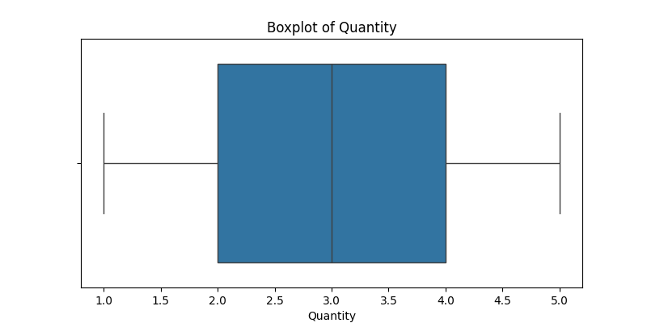
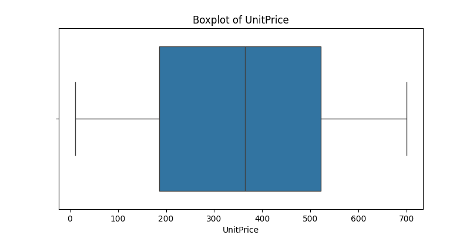
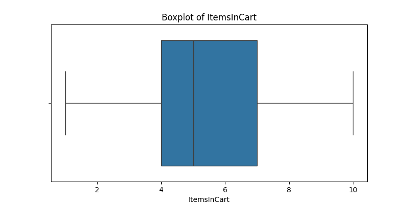
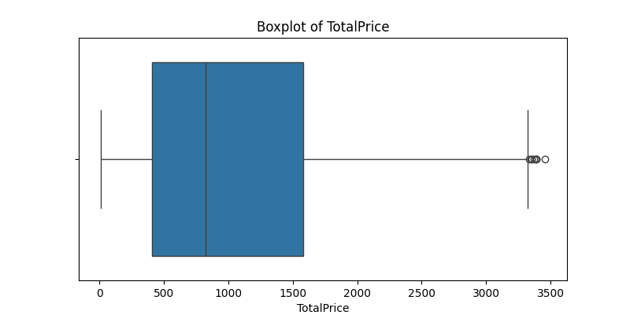
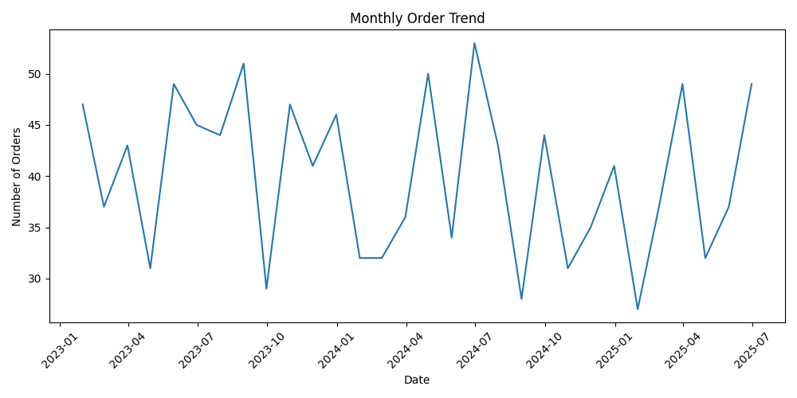
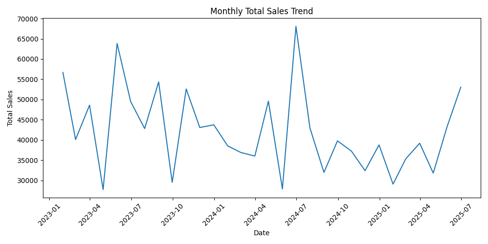

# Project 2 — Exploratory Data Analysis (EDA)

This is Project 2 of my Data Analytics Internship at DecodeLabs.

Project 1 was about cleaning and validating the dataset. In this project, I will use that cleaned and validated dataset to explore what the data is actually telling me by looking for patterns, trends, distributions, and useful observations.

The work is being completed step by step, starting with understanding the purpose of the EDA before moving into the analysis.

## What I Will Explore

- Basic descriptive statistics such as count, mean, median, and the five-number summary
- The shape and distribution of numerical variables
- Differences between mean and median
- Trends and patterns in the data
- Potential outliers using IQR and Z-score methods
- Relationships between variables using correlation analysis
- Visualizations that help explain the findings
- Key observations and the business meaning behind them
- Actionable recommendations where the analysis supports them

## Dataset

The starting point for this project is the cleaned dataset produced in Project 1.

The cleaned dataset contains 1,200 records and 14 columns and is stored in:

`data/input/cleaned_dataset.xlsx`

Using the cleaned dataset keeps this project focused on analysis rather than repeating the data-cleaning work from Project 1.

## Project Approach

The analysis will follow a simple process:

**Question → Exploration → Evidence → Insight**

The first task is to establish the purpose of the EDA and confirm that the cleaned Project 1 dataset is being used as the starting point for the analysis.

## Tools Used

- Python
- Pandas
- Jupyter Notebook
- Matplotlib
- Seaborn

## Project Structure

```text
exploratory-data-analysis/
│
├── data/
│   └── input/
│       └── cleaned_dataset.xlsx
│
├── images/
│   ├── 01_quantity_distribution.png
│   ├── 02_unit_price_distribution.png
│   ├── 03_items_in_cart_distribution.png
│   ├── 04_total_price_distribution.png
│   ├── 05_boxplot_quantity.png
│   ├── 06_boxplot_unitprice.png
│   ├── 07_boxplot_itemsincart.png
│   ├── 08_boxplot_totalprice.png
│   ├── 09_monthly_order_trend.png
│   ├── 10_monthly_total_sales_trend.png
│   ├── 11_monthly_order_trend.png
│   └── 12_monthly_total_sales_trend.png
│
├── notebooks/
│   └── 01_project_purpose.ipynb
│
├── CHANGE_LOG.md
├── README.md
├── requirements.txt
└── SUMMARY.md
```

## Chart Preview

The analysis includes visual evidence to make the results easier to understand. The charts below give a quick preview of the distributions, outliers, and time-based trends explored in the project.

### Numerical Distributions

**Quantity Distribution** — Shows how order quantities are distributed across the dataset.


**Unit Price Distribution** — Shows the distribution of unit prices across the records.


**Items in Cart Distribution** — Shows how the number of items in each cart is distributed.


**Total Price Distribution** — Shows how total order values are distributed and helps highlight the overall spread of sales values.


### Outlier Analysis

**Quantity Boxplot** — Helps check the spread of quantity values and identify potential outliers.



**Unit Price Boxplot** — Helps show the spread of unit prices and whether unusual values are present.



**Items in Cart Boxplot** — Shows the spread of cart sizes and helps identify unusual observations.



**Total Price Boxplot** — Highlights unusually high or low total order values for further investigation.



### Monthly Trends

**Monthly Order Trend** — Shows how the number of orders changes over time.



**Monthly Total Sales Trend** — Shows how total sales change from month to month.



**Additional Monthly Order Trend Chart** — Saved chart showing the monthly order trend from the analysis.


**Additional Monthly Total Sales Trend Chart** — Saved chart showing the monthly total sales trend from the analysis.


## Final Output

The final notebook will contain the completed exploratory analysis, visual evidence, key observations, and conclusions from the dataset.

### Current Progress

**Task 1 — Project Purpose: Completed**

The cleaned dataset from Project 1 has been loaded successfully and confirmed as the starting point for the EDA. The dataset contains 1,200 records and 14 columns.

The remaining parts of Project 2 will be added separately as each task is completed and verified.

## Internship

**Program:** Data Analytics Internship  
**Organization:** DecodeLabs  
**Project:** Project 2 — Exploratory Data Analysis (EDA)
