# Project 2 — Exploratory Data Analysis (EDA)

This is Project 2 of my Data Analytics Internship at DecodeLabs.

Project 1 was about cleaning and validating the dataset. In this project, I use that cleaned dataset to explore patterns, trends, distributions, unusual observations, and relationships between variables.

The project is organised into tasks, with each stage reviewed before moving to the next one. Tasks 1–6 are now documented in the notebook and project files.

## What I Will Explore

- Basic descriptive statistics such as count, mean, median, and the five-number summary
- The shape and distribution of numerical variables
- Differences between mean and median
- Monthly trends in order activity and total sales
- Potential outliers using IQR and Z-score methods
- Relationships between numerical variables using Pearson correlation
- Visualizations that help explain the findings
- Key observations and their meaning in context
- An evidence-based summary of the main analytical findings
- Business recommendations in the next project task, where the evidence supports them

## Dataset

The starting point is the cleaned dataset produced in Project 1.

- **Records:** 1,200
- **Columns:** 14
- **Input file:** `data/input/cleaned_dataset.xlsx`

Using the cleaned dataset keeps this project focused on analysis rather than repeating the data-cleaning work from Project 1.

## Project Approach

The analysis follows a simple process:

**Question → Exploration → Evidence → Insight**

## Tools Used

- Python
- Pandas
- Jupyter Notebook
- Matplotlib
- Seaborn
- SciPy

## Project Structure

```text
exploratory-data-analysis/
├── data/
│   └── input/
│       └── cleaned_dataset.xlsx
├── images/
│   ├── 01_quantity_distribution.png
│   ├── 02_unit_price_distribution.png
│   ├── 03_items_in_cart_distribution.png
│   ├── 04_total_price_distribution.png
│   ├── 05_monthly_order_trend.png
│   ├── 06_monthly_total_sales_trend.png
│   ├── 07_boxplot_quantity.png
│   ├── 08_boxplot_unit_price.png
│   ├── 09_boxplot_items_in_cart.png
│   ├── 10_boxplot_total_price.png
│   ├── 11_correlation_heatmap.png
│   ├── 12_unitprice_vs_totalprice.png
│   ├── 13_quantity_vs_totalprice.png
│   └── 14_itemsincart_vs_totalprice.png
├── notebooks/
│   └── exploratory_data_analysis.ipynb
├── CHANGE_LOG.md
├── README.md
├── requirements.txt
└── SUMMARY.md
```

## Descriptive Statistics — Chart Preview

### 1. Quantity Distribution

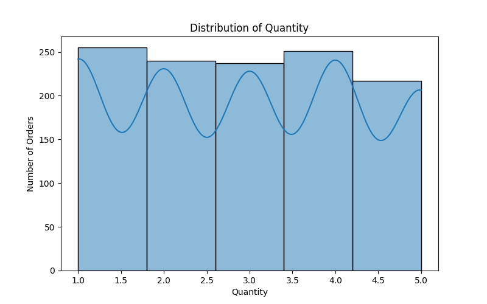

This histogram shows how many units were purchased in each order. The observed values range from 1 to 5.

### 2. Unit Price Distribution

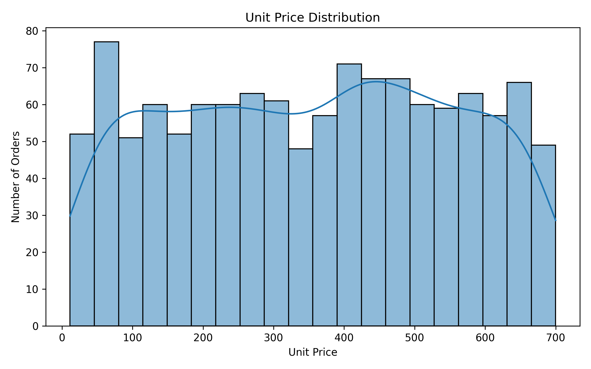

This chart shows the spread of unit prices. The mean and median are close, so the distribution is centred fairly evenly.

### 3. Items in Cart Distribution

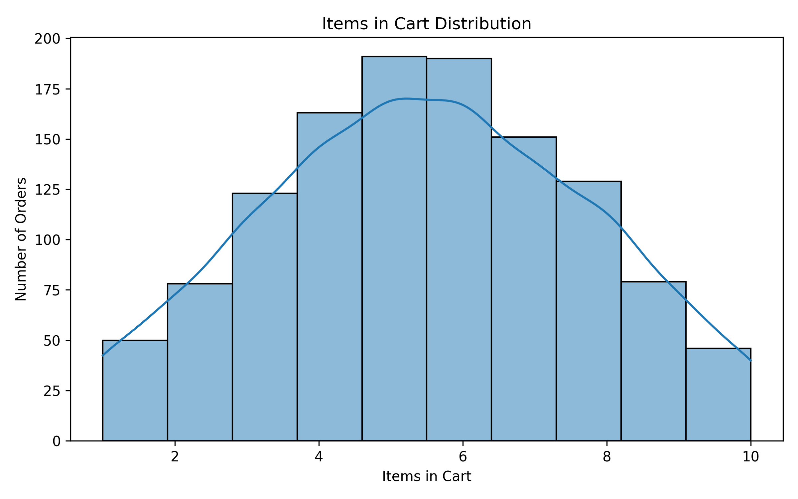

This histogram shows how the number of items in the cart is distributed across the records.

### 4. Total Price Distribution

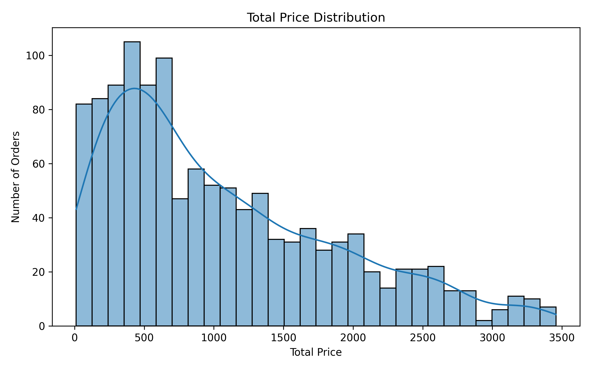

The mean `TotalPrice` is higher than its median, which is consistent with higher-value orders pulling the average upward.

## Trends and Outliers — Chart Preview

### 5. Monthly Order Trend

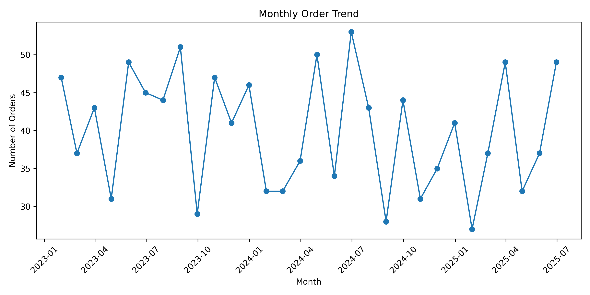

Monthly order activity fluctuates from January 2023 to June 2025. June 2024 recorded the highest monthly order count, at 53.

### 6. Monthly Total Sales Trend

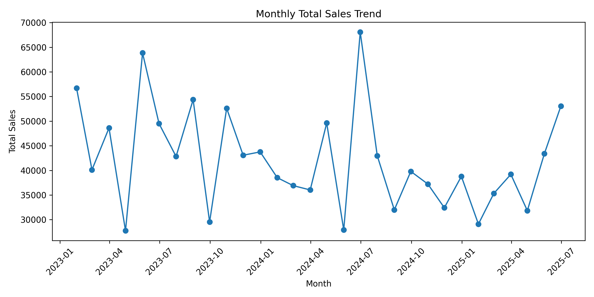

Monthly total sales fluctuate over the same period. June 2024 had the highest monthly total sales, at 68,068.54.

### 7. Quantity Boxplot

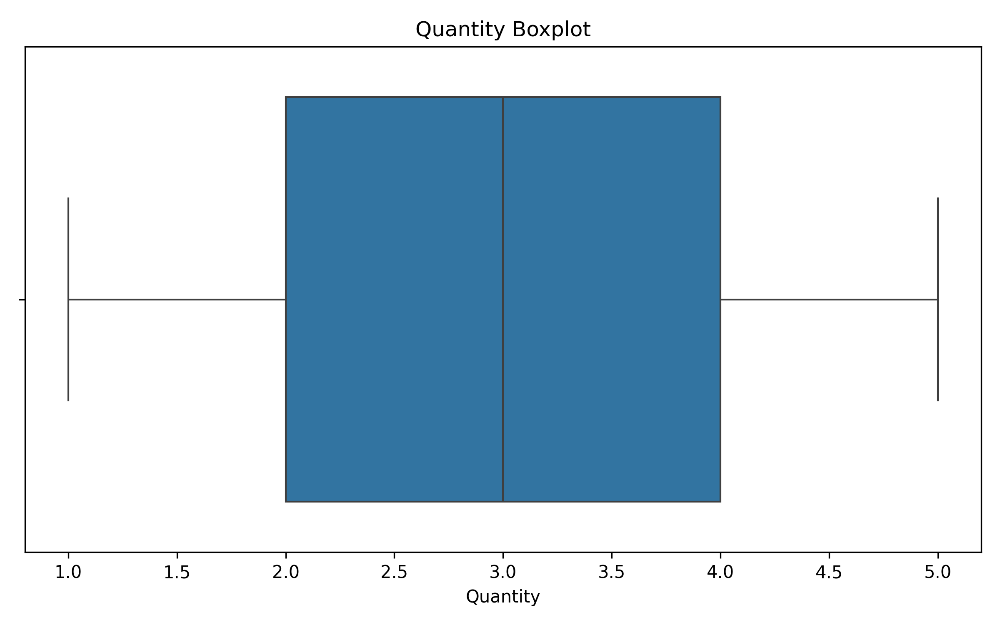

The IQR method did not identify potential outliers in `Quantity`.

### 8. Unit Price Boxplot

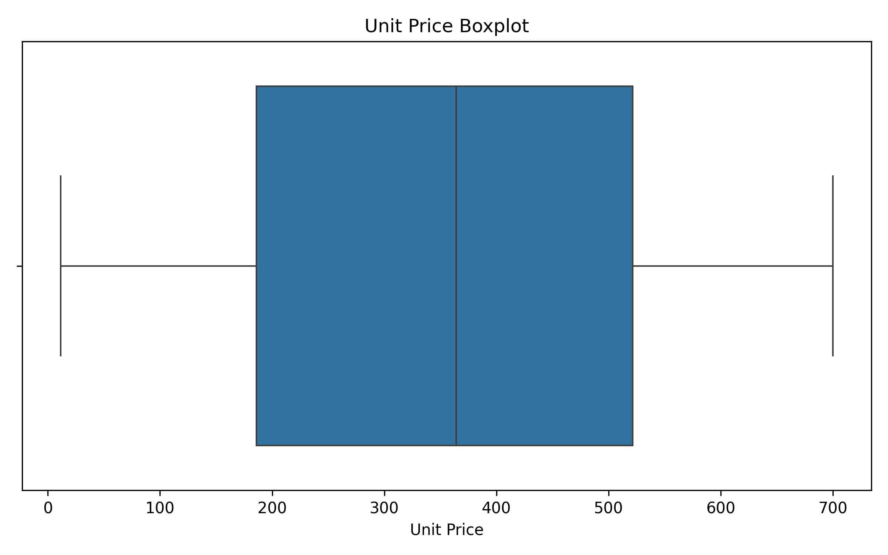

The IQR method did not identify potential outliers in `UnitPrice`.

### 9. Items in Cart Boxplot

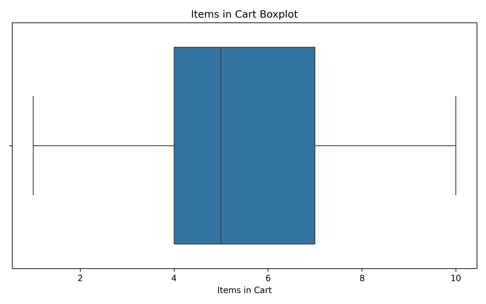

The IQR method did not flag observations in `ItemsInCart`.

### 10. Total Price Boxplot

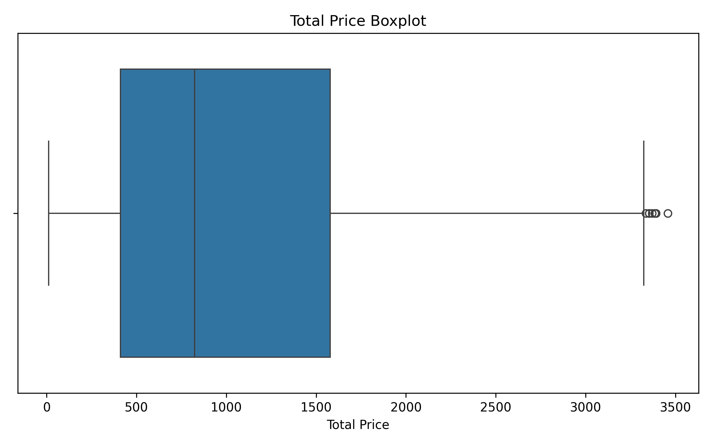

The IQR method flagged eight unusually high `TotalPrice` records for further investigation.

## Relationships and Correlation — Chart Preview

Task 4 uses Pearson correlation to explore linear relationships between `Quantity`, `UnitPrice`, `ItemsInCart`, and `TotalPrice`.

### 11. Pearson Correlation Heatmap

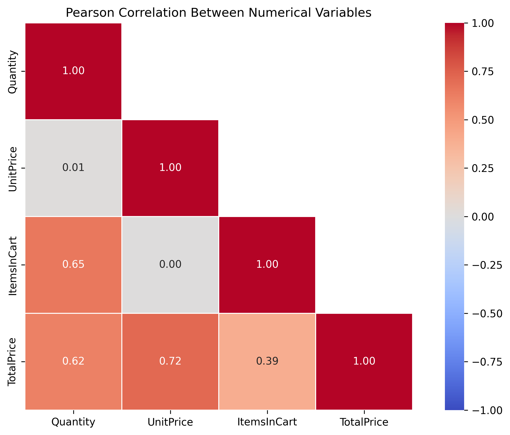

The heatmap compares the Pearson correlation values for the four numerical variables.

### 12. Unit Price vs Total Price

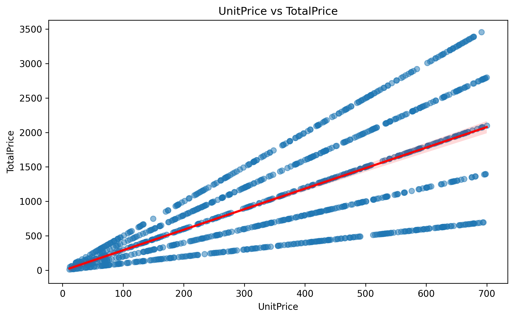

The correlation is approximately **0.717**, indicating a strong positive linear association. `TotalPrice` is calculated using `Quantity × UnitPrice`, so this relationship should be interpreted in the context of that formula.

### 13. Quantity vs Total Price

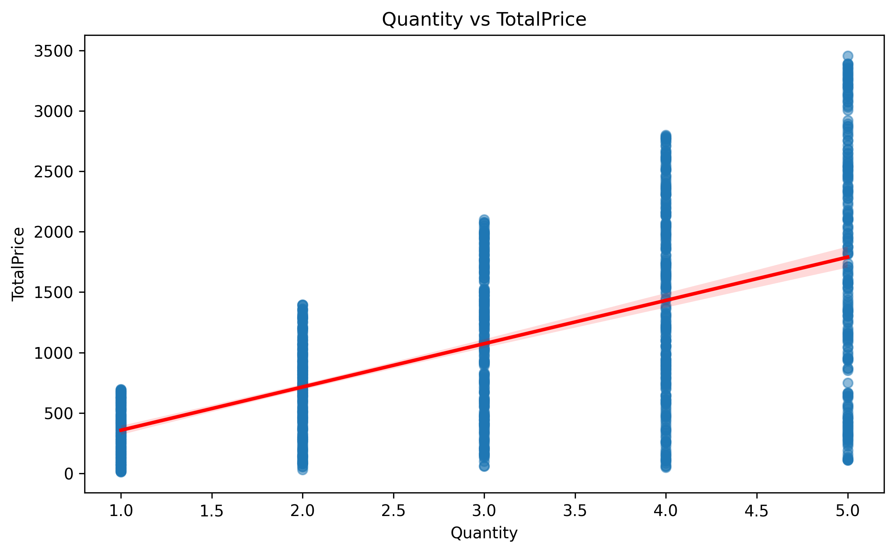

The correlation is approximately **0.615**, indicating a positive linear association between quantity and total price.

### 14. Items in Cart vs Total Price

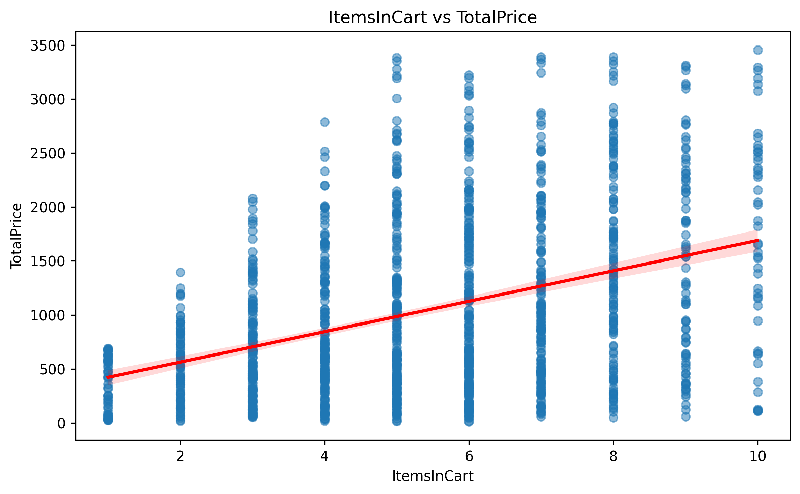

The correlation is approximately **0.393**, indicating a moderate positive linear association.

## Task 4 — Main Correlation Findings

Pearson correlation was calculated for all six unique pairs of numerical variables.

| Variable pair              | Pearson correlation | Interpretation                       |
| -------------------------- | ------------------: | ------------------------------------ |
| UnitPrice and TotalPrice   |               0.717 | Strong positive linear association   |
| Quantity and ItemsInCart   |               0.650 | Strong positive linear association   |
| Quantity and TotalPrice    |               0.615 | Strong positive linear association   |
| ItemsInCart and TotalPrice |               0.393 | Moderate positive linear association |
| Quantity and UnitPrice     |               0.015 | Little or no linear association      |
| UnitPrice and ItemsInCart  |               0.001 | Little or no linear association      |

The tests at the 5% significance level found statistically significant correlations for the four pairs with larger correlation values. The correlations between `Quantity` and `UnitPrice`, and between `UnitPrice` and `ItemsInCart`, were not statistically significant.

The eight high-value `TotalPrice` records identified in Task 3 were temporarily excluded for a sensitivity check. The correlation values changed only slightly, so the relationships were not heavily influenced by those records in this comparison.

The `TotalPrice` calculation was also checked against `Quantity × UnitPrice`. All 1,200 records matched after rounding to two decimal places.

**Correlation does not imply causation.** In particular, the relationship between `TotalPrice` and the variables used to calculate it is partly built into the dataset's formula. The results describe linear associations in this dataset and should not be treated as proof of cause and effect.

## Visual Evidence — Task 5

Task 5 reviewed the existing visuals and made targeted improvements rather than adding charts without a clear purpose.

### Improvements made

- Updated `06_monthly_total_sales_trend.png` with less crowded date labels, clearer sales-axis formatting, and an annotation for the highest-sales month.
- Added `15_unitprice_vs_totalprice_review.png` as a clearer review version of the scatter plot. The original chart is preserved.
- Added `16_totalprice_boxplot_review.png` with the upper IQR limit marked. The eight flagged `TotalPrice` observations remain in the analysis.
- Checked the inventory of 16 expected chart files. The notebook's recorded check found all 16 files and no missing files.

### How the visuals support the analysis

- Distribution charts show how the numerical values are spread.
- Monthly trend charts show changes in order activity and sales over time.
- Boxplots help identify unusual observations for further investigation.
- The heatmap and scatter plots show linear associations between numerical variables.

The relationship between `UnitPrice` and `TotalPrice` needs particular care because `TotalPrice` is calculated as `Quantity × UnitPrice`. Correlation describes association and does not establish causation. The currency is not labelled as a specific currency because it has not been confirmed by the available dataset documentation.

## Task 6 — Analytical Insights

Task 6 brings the results from the earlier analysis together and explains the main findings in plain language.

### Main findings

- **Monthly activity varied:** June 2024 had the highest monthly total sales (68,068.54) and the highest monthly order count (53). January 2025 had the lowest monthly order count (27), while April 2023 had the lowest monthly total sales (27,751.71).
- **Order values are positively skewed:** `TotalPrice` had a mean of 1,053.97 and a median of 823.62, with skewness of 0.89. Higher-value transactions pull the mean above the median.
- **Some numerical variables move together:** `UnitPrice` and `TotalPrice` had the strongest Pearson correlation (0.717), followed by `Quantity` and `ItemsInCart` (0.650), and `Quantity` and `TotalPrice` (0.615). The `TotalPrice` relationship must be interpreted carefully because it is calculated from `Quantity × UnitPrice`.
- **Unusual values were investigated:** the IQR method flagged eight `TotalPrice` records (0.67% of the dataset). The records matched the expected calculation and were retained because an IQR flag alone does not prove an error.
- **The results have limits:** the dataset shows patterns and associations, but it does not establish why monthly results changed or prove cause and effect.

These findings summarise the available evidence. They do not assume a specific currency because the dataset documentation does not confirm one.

## Current Progress

**Task 1 — Project Purpose: Completed**

Loaded the cleaned dataset from Project 1 and confirmed that it contains 1,200 records and 14 columns.

**Task 2 — Descriptive Statistics: Completed**

Calculated count, mean, median, five-number summaries, skewness, and mean-versus-median differences. Created distribution charts for the four numerical variables.

**Task 3 — Trends and Outliers: Completed**

Analysed monthly order activity and total sales from January 2023 to June 2025. The IQR method flagged eight `TotalPrice` records (0.67% of the dataset). Their calculated totals matched `Quantity × UnitPrice`; the Z-score method found no records beyond the threshold of 3. The eight records are retained for the remaining analysis.

**Task 4 — Relationships and Correlation: Completed**

Calculated Pearson correlations for all six unique variable pairs, created a heatmap and three scatter plots, tested statistical significance, checked the `TotalPrice` calculation, and compared correlations with and without the eight high-value `TotalPrice` records. The analysis treats correlation as association, not causation.

**Task 5 — Visual Evidence: Completed**

Reviewed the 14 original charts and made targeted presentation improvements to the monthly sales trend, `UnitPrice` versus `TotalPrice` scatter plot, and `TotalPrice` boxplot. The final inventory lists 16 expected chart files, including the two separately saved review charts; the recorded notebook check found all 16 files. The eight IQR-flagged `TotalPrice` records remain included, and the charts are interpreted as evidence of patterns rather than proof of causation.

**Task 6 — Analytical Insights: Completed**

Brought the main findings together in the notebook, covering monthly sales and order activity, the distribution of order values, numerical relationships, and high-value transactions. The conclusions remain tied to the available evidence and acknowledge that the analysis cannot explain the causes of monthly changes or establish causation.

## Internship

**Program:** Data Analytics Internship  
**Organization:** DecodeLabs  
**Project:** Project 2 — Exploratory Data Analysis (EDA)
